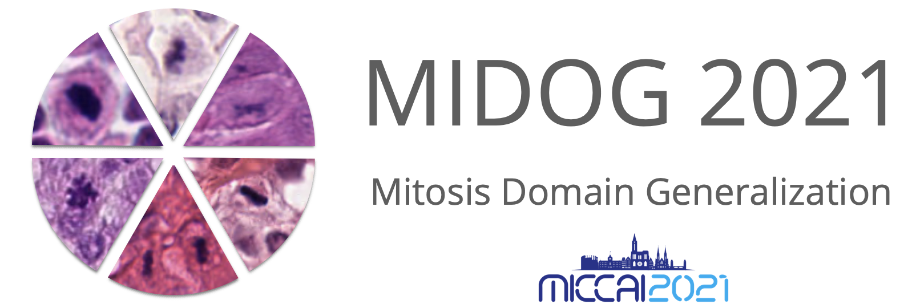

Welcome to the MIDOG github repository. Here you can find code of our own evaluations and a dockered reference algorithm for mitotic figures to use as a template.

If you haven't registered yet and want to take part in the challenge, please register [here](https://imi.thi.de/midog/register/).

The folder [DomainShiftQuantization](https://github.com/DeepPathology/MIDOG/tree/main/DomainShiftQuantification) contains code of our MIDL paper [Quantifying the Scanner-Induced Domain Gap in Mitosis Detection](https://arxiv.org/pdf/2103.16515.pdf).

The repository MIDOG_reference_docket (http://github.com/DeepPathology/MIDOG_reference_docker) contains a reference docker container with a baseline algorithm for the MIDOG challenge.

And finally, the folder [databases](https://github.com/DeepPathology/MIDOG/tree/main/databases) contains all databases (annotations) of the MIDOG challenge training set.
 
